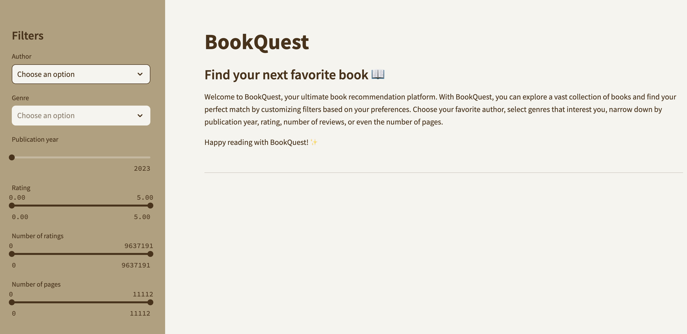

# BookQuest 📖

1. [What it is ✍🏻](#whatitis)
2. [ETL process 🔎](#etl)
3. [Visualization 💻](#vis)
4. [Future steps 🔮](#future)

<a name="whatitis"/>

'BookQuest' is the personalized book recommendation system. The idea for this project came about because many friends and relatives often asked me if I had any reading recommendations for them. As an English philologist and a lover of reading, I have read many books throughout my life, however, I often did not have an answer. That is why I decided to combine my programming skills with a personal hobby to create this application. 

<a name="etl"/>

## ETL PROCESS

For its development, I performed an ETL process:

### EXTRACTION 🏗️

The extraction process was based on a web scrapping from 'goodreads.com' of 50k books along with their information. For this I used BeautifulSoup methods to extract such data as:

- **Cover**: includes the link of the cover picture of the book. 
- **Title**: includes the tile of the book.
- **Author**: includes the main author of the book.
- **Genres**: includes up to five genres the book belongs to.
- **Rating**: includes the rating from 0 to 5.
- **Ratings' count**: includes the amount of people that have rated the book.
- **Reviews' count**: includes the amount of people that have written a review on the book.
- **Publication date**: includes the publication date of the book in the year/month/day format. 
- **Number of pages**: includes the numbner of pages the book has.

### TRANSFORMATION ↺

The transformation process was mainly based on: 

- Making sure that there were not null values, either modifying or deleting them, depending on their importance. 
- Modifying the data type of each column for them to match what they represent. 
- Eliminating duplicated data taking the 'Title' column as the referencial one.
- Ensuring that all data had the same format.

### LOAD 🪨

The loading process was done through Mongo, the non-relational database that has a dictionary-like structure. 

<a name="vis"/>

## VISUALIZATION

I visualized the data with Streamlit. It is a user-friendly platform connected to my Mongo database in which users can apply different filters for it to show their perfect book match(es). 

I included a brief description of the app on its main page so that users can know what to expect from it. 

They can also apply filters on any previously mentioned variable collected in the scrapping process. They are permanently displayed on the left side of the page so that they can always modify them. They are also interconnected, meaning that if you choose for example an author, the genres filter will automatically narrow down to the only matching ones, and so on and so forth. 

<a name="future"/>

## FUTURE STEPS 

- I would like to automatize the process so that the database and as a consequence, the app, are always as much up to date as possible. 
- I would like to include a shopping link to an external webpage so that users get the full reading experience and not only the preliminar recommendation step. 
- I would also like to have the database translated to other languages, so that it would be accessible for more people. 
